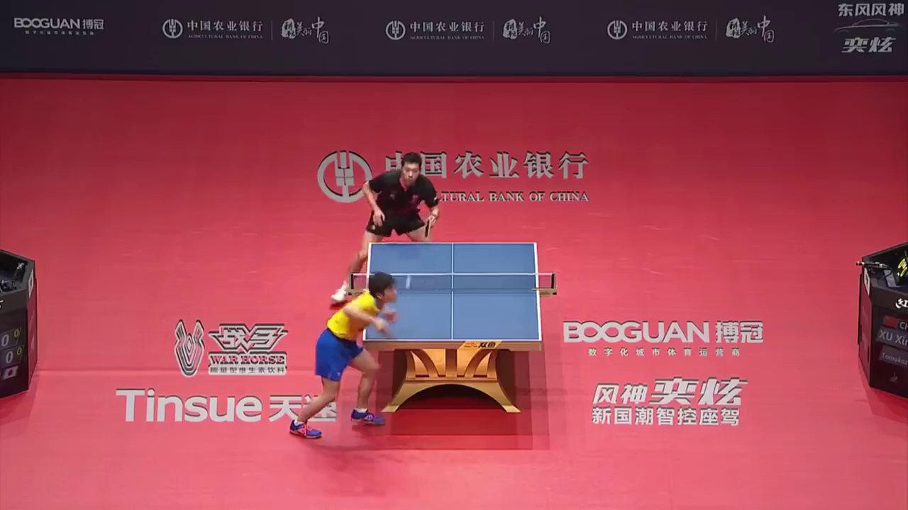
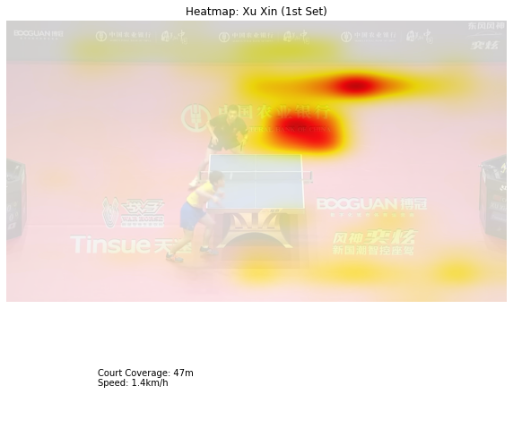
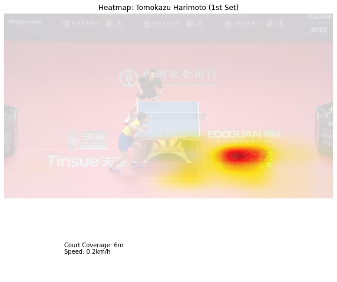

# Table Tennis Analytics
This project utilizes the YOLO (You only look once) algorithm to recognize players and map each of their movements into a heatmap plot to analyse the efficiency from their movements.

## Usage
1. Download a table tennis match video. I will be using the [Tomokazu Harimoto vs. Xu Xin](https://www.youtube.com/watch?v=oRWJrm35FD8) from 2019 WTTF World Tour Grand Finals.

2. Run the `extract_court.py` to extract the table tennis court. This script will automatically convert the first frame of the video and save it to a `.png` file. So make sure that you edit the video so that the first frame is where both players and the table are seen.

3. Run `analyze.py` to analyze the video. Please bear in mind that this process might take hours or even days depending on the length of the video. To test it, you can trim down the video to 45 seconds - 1 minute. At the end of the program, you will see something like this:

